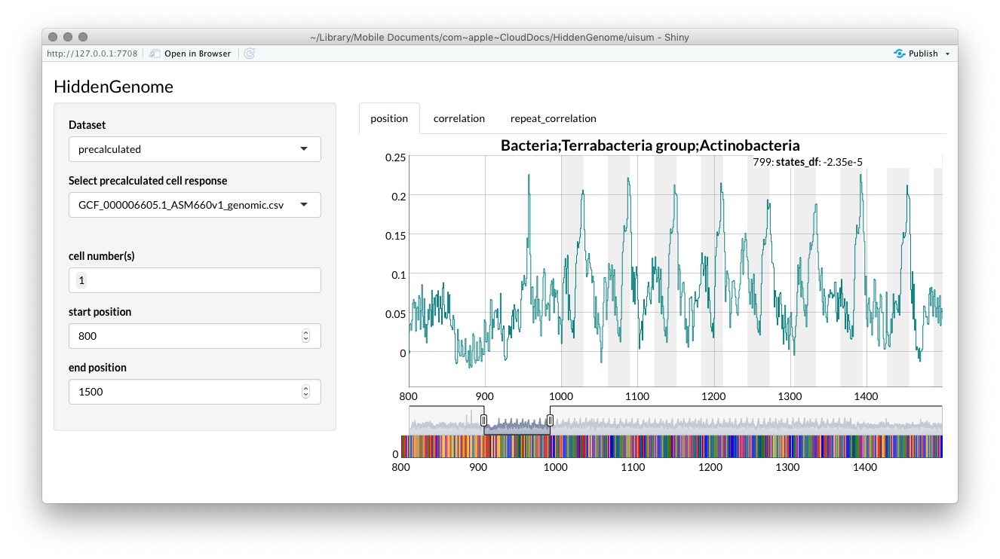

## Introduction

GenomeNet-responseViewer is an open-source interactive web app for visualising hidden states of LSTM networks trained on genomical dataset such as bacteria. The goal of the GenomeNet-responseViewer is to screen hidden states for unkown but common structural properties. The model behind GenomeNet-responseViewer is generated by the R library [deepG](https://github.com/hiddengenome/deepG). The goal of GenomeNet-responseViewer is to provide a view to precalulated state response of a variety of bacterial strains and to provide tools for the detection of such hidden features.

## Installation

If you using RStudio you can run this application on a local computer. It requires the R packages `Biostrings`, `shiny`, `keras`, `h5`, `dygraphs`. The R library `hiddengenome/deepG` needs to be installed as it provides the main function of hidden state extraction. 


## Running GenomeNet-responseViewer

To run GenomeNet-responseViewer please start it as a R shiny server and point your browser to  [localhost:6681](http://http://localhost:6681). You may need to change the port dependent on your shiny installation. 

```bash
runApp()
```

## Usage

Please enter a genomic sequence (nucleotides) in the input area or upload a .fasta file. Hidden states will be infered using `hiddengenome/deepG` and visualized. You can select different cells on the left. 



