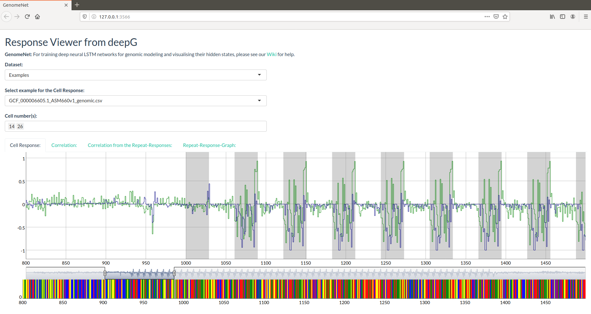

# GenomeNet-responseViewer 

## Introduction

GenomeNet-responseViewer is an open-source interactive web app for visualising hidden states of LSTM networks trained on genomical dataset such as bacteria. The goal of the GenomeNet-responseViewer is to screen hidden states for unkown but common structural properties. The model behind GenomeNet-responseViewer is generated by the R library [deepG](https://github.com/hiddengenome/deepG) [In the future it will be integrated there]. The goal of GenomeNet-responseViewer is to provide a view to precalulated state response of a variety of bacterial strains and to provide tools for the detection of such hidden features.

## Installation

It requires the various R packages, like `Biostrings`, `shiny`, `keras`, `h5`, `dygraphs`. The R library `hiddengenome/deepG` needs to be installed as it provides the main function of hidden state extraction: 

To install deepG use:

```bash
devtools::install_github("hiddengenome/deepG")
```

Make sure you have the `keras` version: 2.2.5.0 and `tensorflow` 2.0.0. Same models only working with GPU support. On default, Keras will be installed without GPU support. To support GPUs reinstall Keras via

```bash
keras::install_keras(tensorflow = "gpu")
```

To install the GenomeNet-ResponseViewer use:
```bash
devtools::install_github("hiddengenome/GenomeNet-ResponseViewer")
```
Or download the Zip-File and extract the files. Choose the directory and enter  
```bash
source("app.R")
```

## Running GenomeNet-responseViewer

```bash
visualizePrediction()
```

## Usage & Examples

Please enter a genomic sequence (nucleotides) in the input area or upload a fasta file. Hidden states will be infered using `hiddengenome/deepG` and visualized. You can select different cells and different models. 

Calculated example with states in the folder "data/ncbi_data/states2:


And the calculated correlation between two cells:


Calculated example with states in the folder "data/ncbi_data/states:


### Example:
```bash
visualizePrediction(sample = read_file("data/CRISPR_Example.txt"), model.path = "data/models/cpu_model.hdf5",  vocabulary = c("l","a","g","c","t"), cell_number = 6)
```


Other examples:

```bash
visualizePrediction(strrep("ATGCGTA",1000))
visualizePrediction(strrep("ATGCGTA",1000), model.path = "data/models/cpu_model.hdf5", vocabulary = c("l","a","g","c","t"))
visualizePrediction(sample = read_file("data/CRISPR_Example_full.txt"))
```
