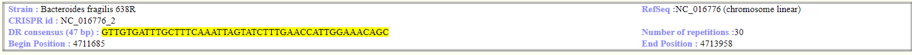
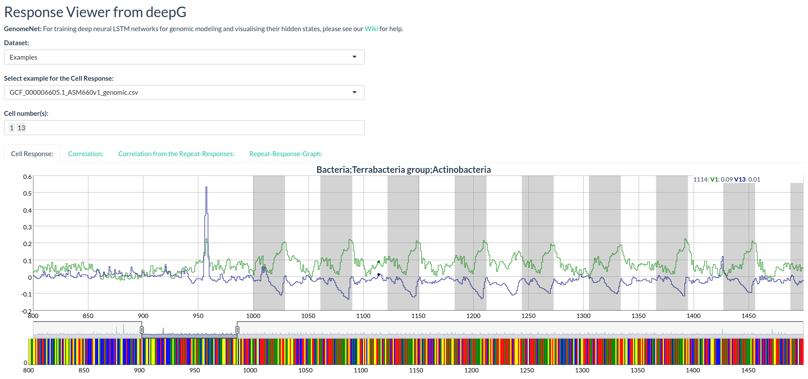
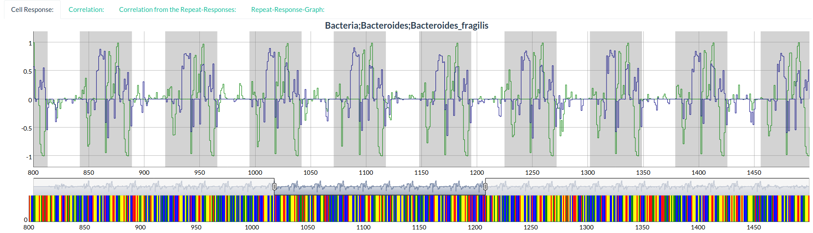
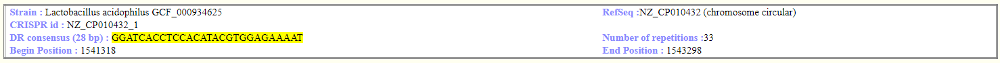
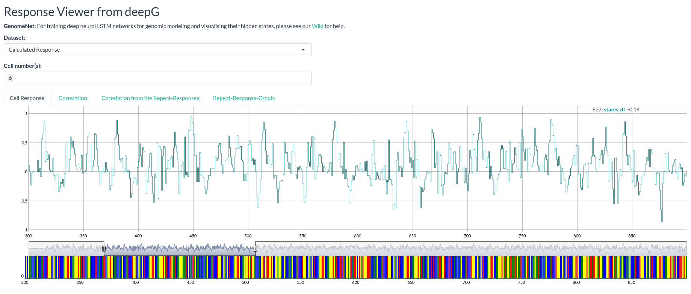
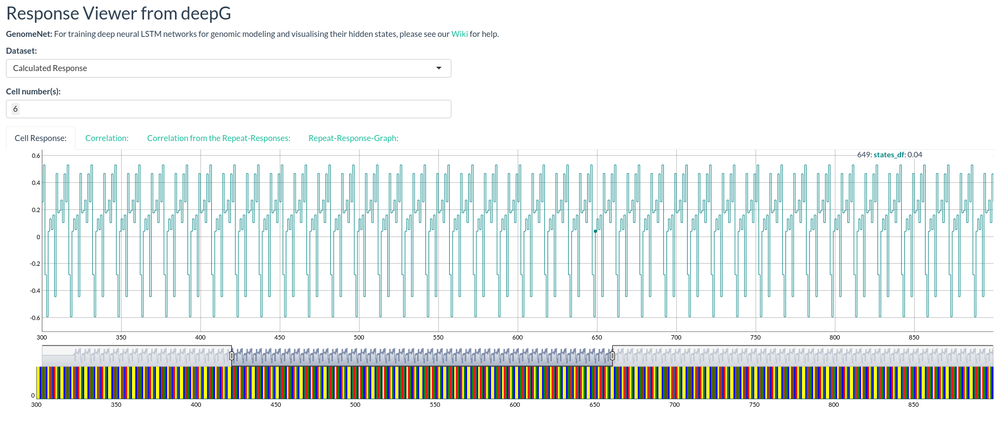

# GenomeNet-responseViewer 

## Introduction

GenomeNet-responseViewer is an open-source interactive web app for visualising hidden states of LSTM networks trained on genomical dataset such as bacteria. The goal of the GenomeNet-responseViewer is to screen hidden states for unkown but common structural properties. The model behind GenomeNet-responseViewer is generated by the R library [deepG](https://github.com/hiddengenome/deepG) [In the future it will be integrated there]. The goal of GenomeNet-responseViewer is to provide a view to precalulated state response of a variety of bacterial strains and to provide tools for the detection of such hidden features.

## Installation

It requires the various R packages, like `Biostrings`, `shiny`, `keras`, `h5`, `dygraphs`. The R library `hiddengenome/deepG` needs to be installed as it provides the main function of hidden state extraction: 

To install deepG use:

```bash
devtools::install_github("hiddengenome/deepG")
```

Make sure you have the `keras` version: 2.2.5.0 and `tensorflow` 2.0.0. Same models only working with GPU support. On default, Keras will be installed without GPU support. To support GPUs reinstall Keras via

```bash
keras::install_keras(tensorflow = "gpu")
```

To install the GenomeNet-ResponseViewer use:
Download the Zip-File and extract the files. Choose the directory and enter  
```bash
source("app.R")
```
In the future this will be integrated into deepG. 

## Running GenomeNet-responseViewer

```bash
visualizePrediction()
```

## Examples

Please enter a genomic sequence (nucleotides) in the input area (or upload a fasta file). Hidden states will be infered using the deepG package and visualized. You can select different cells and different models. Also there are three examples available: The hidden states to "Bacteroides fragilis_CRISPR_example" are calculated with the newest model on CPU. The position of the repeats are colored with grey and you can zoom in and out the graphic.

**CRISPR Sample from Bacteroides fragilis** from the [CRISPRs Database](https://crispr.i2bc.paris-saclay.fr/crispr/)





**CRISPR Sample from Lactobacillus acidophilus** from the [CRISPRs Database](https://crispr.i2bc.paris-saclay.fr/crispr/)



### Usage:

The parameters `sample`,`model.path`,`start_position`,`end_position`,`batch.size`,`vocabulary` and `cell_number` is currently available, more parameters will be added over the time. An easy example is `visualizePrediction(strrep("ATGCGTA",1000))`

```bash
visualizePrediction(sample = strrep("ATGCGTACGTCAGTA", 100), model.path = "data/models/cpu_model.hdf5", vocabulary = c("l","a","g","c","t"), cell_number = 6, start_position = 300, end_position = 900)
```


